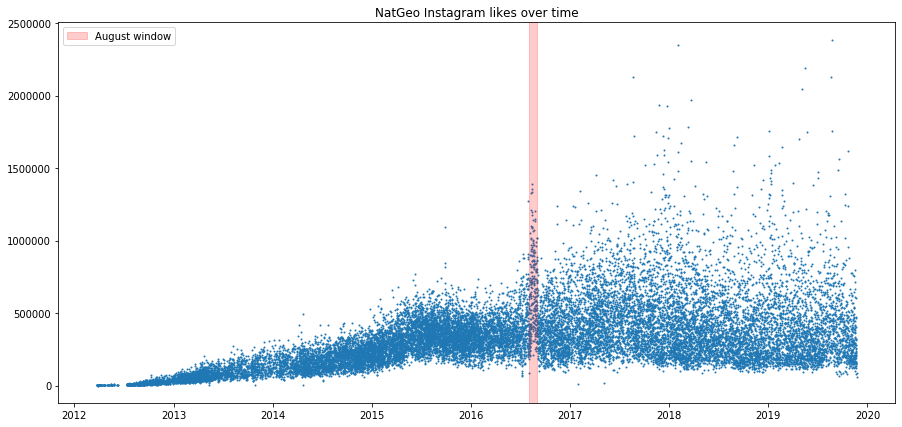
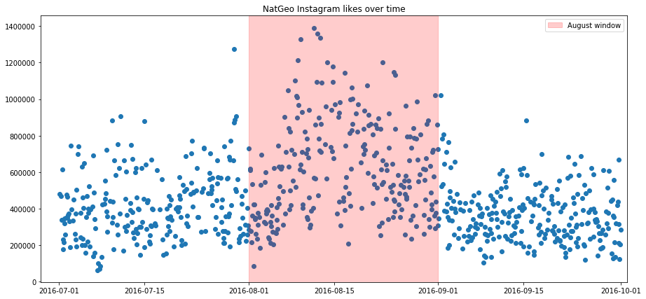
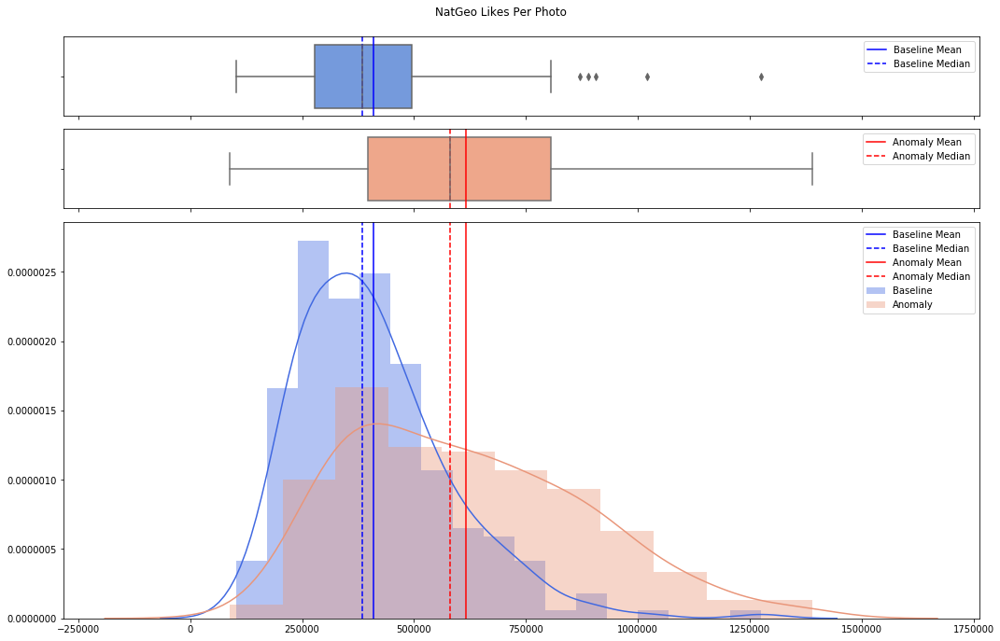
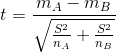
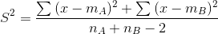
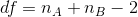

# @NatGeo's August Anomaly

In August 2016, the [@NatGeo](https://www.instagram.com/natgeo) Instagram account experienced a spike in the number of likes per photo:

In September, the following month, National Geographic published the book [@NatGeo: The Most Popular Instagram Photos](https://www.amazon.com/NatGeo-Most-Popular-Instagram-Photos/dp/1426217102). It appears that there was some promotional activity going on during the leadup to the book's release that drove additional traffic to the @NatGeo account (at least, this is the only explanation I can find through my research). However, I wanted to run a statstitical test to see what would the probability be that this spike occurred by sheer random chance.

Because during a short time period around this anomaly the account has basically constant average likes per photo, I decided to treat each post as an independent event. This allows me to use the t-test to compare the means of two distributions: the August posts and the non-August posts. I separated all posts during the 31 days of August into one bucket of data and the final two weeks of July along with the first two weeks of September for another bucket.

This is 245 posts located within the August window and 253 located outside it. Plotting these distributions clearly reveals differing trends:

So, what is the probability that the Baseline Mean and the Anomaly Mean are different by random chance alone?

### Independent t-test formula

Let A and B represent the two groups to compare.
Let mA and mB represent the means of groups A and B, respectively.
Let nA and nB represent the sizes of group A and B, respectively.

The **t test statistic value** to test whether the means are different can be calculated as follows:

S2 is an estimator of the common **variance** of the two samples. It can be calculated as follows:

The **t-test statistic value** is used in a **[t-test table](https://www.sjsu.edu/faculty/gerstman/StatPrimer/t-table.pdf)** to look up the **critical value of Student’s t distribution** corresponding to the **significance level alpha** of your choice (often chosen as 5%). The **degrees of freedom** (df) used in this test is:

If the absolute value of the **t-test statistic** (|t|) is greater than the critical value, then the difference is significant. Otherwise the difference cannot be considered significant. The **level of significance** or (**p-value**) corresponds to the risk indicated by the **[t-test table](https://www.sjsu.edu/faculty/gerstman/StatPrimer/t-table.pdf)** for the calculated |t| value.
The test can be used only when the two groups of samples (A and B) being compared follow bivariate **normal distribution** with equal **variances**.
If the variances of the two groups being compared are different, the **[Welch's t-test](https://en.wikipedia.org/wiki/Welch%27s_t-test)** can be used.

### Plugging in some real numbers
Running through those equations using the average likes per photo for the two distributions reveals the following:
- The t-statistic is -10.431478262230554
- The degrees of freedom is 496.0
- The critical value is 1.6479315230387215
- The p-value is 6.558e-23

That p-value is essentially zero, which tells us that there is a 0% probability that this spike in likes occurred simply by chance. If it wasn't due to the release of @NatGeo's book, then there must be some other explanation.